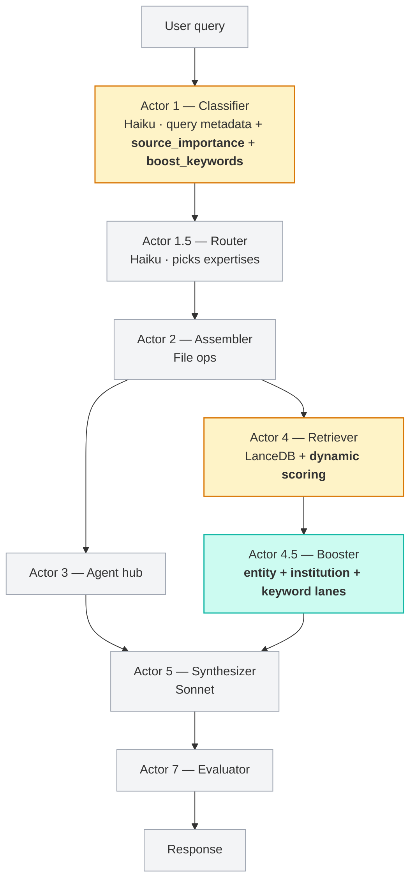
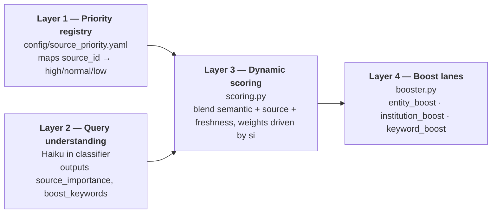

# 02 — Architecture

The source-ranking stack adds **one new actor** and **extends two existing ones** in the m3xabr-core 7-actor pipeline. The rest of the architecture is untouched.

## Where it fits in m3xabr-core



**Legend**: yellow boxes are existing actors that gain new fields/methods. The teal box is the one new actor added by this extension. Grey boxes are unchanged.

## The four scoring layers

The new behaviour is organized as four logical layers. Layers 1–3 plus layer 4's keyword lane live inside Actor 4 (the retriever). Layer 4's entity and institution lanes live in the new Actor 4.5 (the booster), which runs after retrieval to inject additional rows.



Each layer is independent. You can implement L1 + L3 only (skip L2 / L4) and already get a usable improvement over plain semantic. The full stack composes additively — every layer makes a smaller marginal improvement than the one before, in roughly that order of magnitude.

## Data flow per query

For a single query — *"What does Goldman think about EM allocation?"* — the flow is:

1. **Classifier (Actor 1)** runs. Outputs:
   ```json
   {
     "query_type": "analytical",
     "topics": ["em_allocation"],
     "entities": ["goldman"],
     "source_importance": 0.6,
     "boost_keywords": ["goldman", "em", "emerging", "allocation"]
   }
   ```
2. **Retriever (Actor 4)** runs:
   - Embeds the query, fetches top-200 from LanceDB.
   - For each doc: looks up `source_priority(doc.source_id)` from L1.
   - For each doc: computes `score = semantic*(0.70 - si*0.55) + source_score*(0.15 + si*0.55) + freshness*0.15`, where `si = 0.6` from L2.
   - With `boost_keywords` present (L4-keyword lane), lowers `min_similarity` from default 0.50 to 0.20 so keyword-matching docs survive even with mediocre semantic similarity.
   - For each doc whose content contains any boost_keyword: adds an additive 0.05–0.15 boost (depending on match strength) to `score`.
3. **Booster (Actor 4.5)** runs:
   - Sees `entities=["goldman"]` from L2 → triggers **entity lane**: fetches up to `max_boost_rows` (default 5; raised to 15 when `si ≥ 0.5`) additional documents directly from sources whose `source_id` matches Goldman's known handles in the entity registry.
   - Also triggers **institution lane** if Goldman is mapped as an institution: pulls up to 5 documents FROM Goldman (Layer 1: direct authorship) and up to 5 documents that MENTION Goldman in content (Layer 2: cited by others), tagging each row with `track=institution_direct` or `track=institution_cited` for downstream attribution.
   - Returns the original retrieval + boosted rows, deduplicated by `doc_id`, sorted by final `score` descending.
4. **Synthesizer (Actor 5)** consumes the combined list, writes the answer with citations.

For a different query — *"fiscal outlook second half"* — only L1, L3, and the keyword lane fire. `source_importance = 0.0`, no entities, no institutions detected. The scoring formula collapses to the pure baseline (`0.70 · semantic + 0.15 · source + 0.15 · freshness`), which still respects priority but doesn't let it dominate.

## What the existing actors don't change

- **Router (Actor 1.5)** and **Assembler (Actor 2)** are untouched. Expertise composition is orthogonal to source ranking.
- **Agent hub (Actor 3)** is untouched. Source ranking operates only on the document corpus, not on the agent-context layer.
- **Synthesizer (Actor 5)** is untouched. It receives the same `list[RetrievedDoc]` shape it always did — just with a smarter ordering and a couple of new optional metadata fields (`source_priority`, `boost_source`).
- **Evaluator (Actor 7)** is untouched. If you care about source-attribution in the evaluation rubric, you can extend the rubric prompt — the architecture doesn't force it.

## Module map

```
m3xabr_core/
├── actors/
│   ├── classifier.py     ← extended: emit source_importance + boost_keywords
│   ├── retriever.py      ← extended: dynamic scoring (L1 + L3) + keyword boost (L4-kw)
│   └── booster.py        ← NEW: entity + institution lanes (L4-ent + L4-inst)
├── schemas.py            ← extended: add fields to ClassifierOutput + RetrievedDoc
├── scoring.py            ← NEW: dynamic blend formula
└── registries/
    ├── source_priority.yaml   ← NEW: priority registry
    └── entity_registry.yaml   ← NEW: entity / institution name aliases
config/
└── classifier_prompt.md  ← extended: source_importance instructions + examples
```

Three new files, three extensions, zero deletions. The whole stack is reversible by removing the new files and reverting the extensions.

Read [`03-priority-registry.md`](03-priority-registry.md) next for the first concrete piece.
